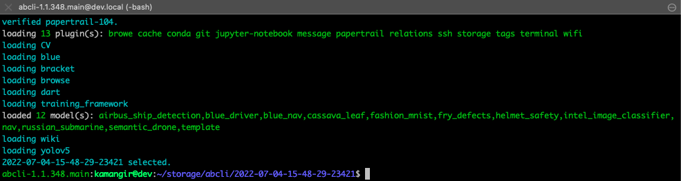

# awesome bash cli (abcli/abc)



`abcli` 🚀 is an implementation of [🔻 giza](https://github.com/kamangir/giza) and the library behind [these projects](https://github.com/kamangir/kamangir).

To install `abcli` follow the instructions for (⚠️ outdated instructions ⚠️):

- [Amazon EC2 instances](https://github.com/kamangir/awesome-bash-cli/wiki/ec2)
- [Amazon SageMaker](https://github.com/kamangir/blue-plugin/blob/main/SageMaker.md)
- [Jetson Nano](https://github.com/kamangir/awesome-bash-cli/wiki/Jetson-Nano)
- [macOS](https://github.com/kamangir/awesome-bash-cli/wiki/macOS)
- [Raspberry Pi](https://github.com/kamangir/awesome-bash-cli/wiki/Raspberry-Pi)

To see the list of `abcli` commands type in:

```
abcli ?
```

# configuration

create a copy of [`sample.env`](./sample.env) as `.env` and fill in the secrets.

# branches

- [current](.) active and default branch.
- [main](https://github.com/kamangir/awesome-bash-cli/tree/main) legacy branch, is running on [a cluster of Raspberry pis](https://github.com/kamangir/blue-bracket). ⚠️ do not touch. ⚠️
