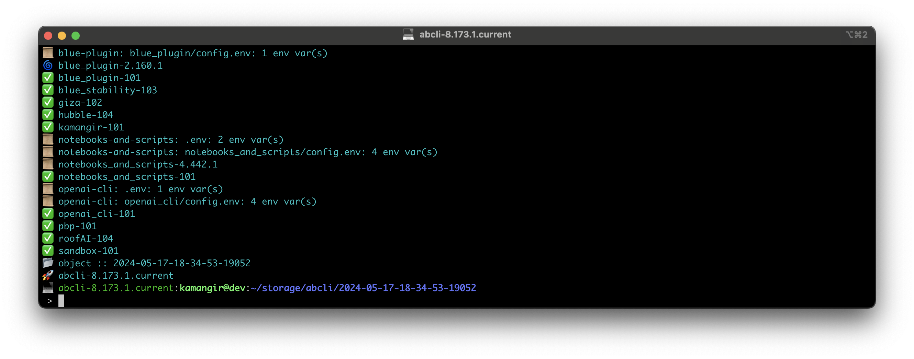

# awesome bash cli (abcli/abc)



`abcli` is a framework for quickly building awesome bash cli's for machine vision/deep learning, like [this robot](https://github.com/kamangir/blue-rvr) - a [`bashly`](https://github.com/DannyBen/bashly) that doesn't need a docker image to run and expands less painfully.

to see list of `abcli` commands type in:

```
abc ?
```

`abcli` can be installed manually or through the [seed](bash/plugins/seed.sh) - either way add this line to the end of `~/.bashrc`/`~/.bash_profile` after the install.

```
source ~/git/awesome-bash-cli/bash/abcli.sh
```

### manual install

clone this repo:

```
mkdir -p ~/git; cd ~/git; git clone git@github.com:kamangir/awesome-bash-cli.git
```

then open a terminal and walk through the install process.
## install through the seed

find a machine that is already terraformed by `abcli` and open two terminals - in the first terminal ssh to the target machine - in the second terminal run:

```
abc seed
```

now switch to the first terminal and paste the clipboard (`Ctrl+V`)

---

to configure `abcli` use [these instructions](./bash/bootstrap/config/README.md).


